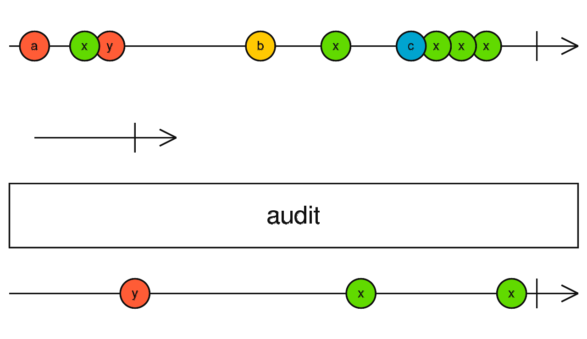

# `@terra-dev/audit-fastdom`

Deduplicate [fastdom](https://www.npmjs.com/package/fastdom) callbacks.



## API

<!-- source index.ts --pick "auditMeasure" -->

[index.ts](index.ts)

```ts
export function auditMeasure(fn: () => void): () => void {}
```

<!-- /source -->

## Usage

```js
//import { measure } from 'fastdom'
//
//window.addEventListener('wheel', () => {
//  measure(() => {
//    // do fastdom measure action
//  })
//})

import { auditMeasure } from '@terra-dev/audit-fastdom';

const callback = auditMeasure(() => {
  // do fastdom measure action
});

window.addEventListener('wheel', () => {
  callback();
});
```
